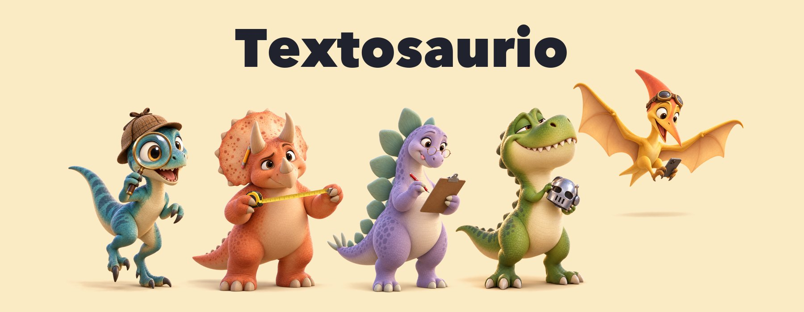
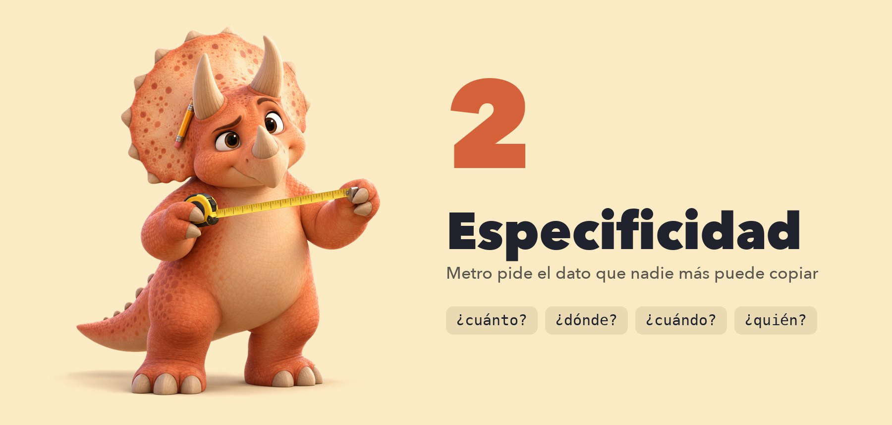
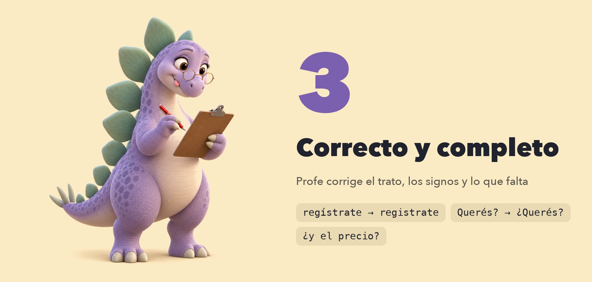
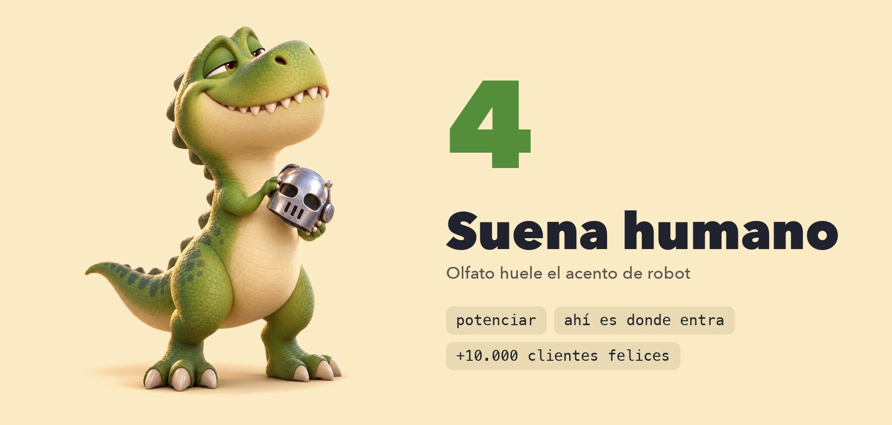

# Textosaurio



**Revisá cualquier texto en español hecho con IA antes de publicarlo.**

Le pasás una landing, un artículo de blog o un post, y te devuelve cinco puntajes del 1 al
10, un puntaje general y la lista de qué cambiar. Si querés, aplica los cambios y vuelve a
puntuar.

Está pensado para quienes escriben para la web en español: agencias, freelancers, equipos
de marketing y cualquiera que usa ChatGPT, Claude o Gemini para escribir y no quiere que se
note.

## Cómo se ve

```
/textosaurio landing.md

Textosaurio · landing.md · web · trato: vos

  1  Sin completar            1/10
  2  Especificidad            6/10
  3  Correcto y completo      8/10
  4  Suena humano             8/10
  5  Hecho para el formato    8/10

  GENERAL  6/10 (el promedio da 6,2, pero quedan huecos y hay testimonios sin respaldo)

¿Qué recomendaciones querés ver?
  › Todas
    Solo de los puntajes menores a 8
    Solo de los puntajes menores a 6
```

Después te muestra cada recomendación con la frase original, la propuesta y el porqué. Si
le decís que las aplique, escribe el texto mejorado en un archivo nuevo y te muestra el
antes y el después.

## Instalarlo

Necesitás [Claude Code](https://claude.com/claude-code) y Python 3. En Mac, Python ya viene
instalado. En Windows, bajalo de [python.org](https://www.python.org/downloads/).

**Un solo paso.** Pegá esto en la terminal:

```bash
git clone https://github.com/alfonsopintos89/textosaurio ~/.claude/skills/textosaurio
```

Listo. Abrí Claude Code en la carpeta de tu proyecto y escribí:

```
/textosaurio index.html
```

También funciona si le hablás normal: «revisá este texto», «puntuá esta landing», «¿esto
suena a IA?».

**¿Usás otro agente?** (Codex, Cursor, Gemini CLI.) Clonalo en cualquier carpeta y decile
al agente que siga las instrucciones de `SKILL.md`. Son instrucciones en texto, nada
específico de Claude.

## Usarlo

| Querés revisar | Escribí |
|---|---|
| Una página web | `/textosaurio index.html` |
| Un artículo | `/textosaurio articulo.md` |
| Un post que pegás en el chat | `/textosaurio` y pegá el texto |
| Un post de LinkedIn | `/textosaurio post.txt, es para LinkedIn` |
| Un texto que tutea o trata de usted | `/textosaurio landing.html, está en usted` |

Tu archivo original no se toca. El texto mejorado va a un archivo nuevo al lado:
`index.html` → `index.textosaurio.html`.

## Los cinco dinosaurios

Cada puntaje lo cuida un dinosaurio. Todos van del 1 al 10.


### 1. Sin completar

Lo que quedó de la plantilla: corchetes como `[Nombre]` o `[precio]`, `XX` en lugar de un
número, mails como `hola@ejemplo.com`, teléfonos como `1234-5678`, `lorem ipsum`, botones que
no llevan a ningún lado.

Parece obvio, pero es el problema más común. Cuando le pedís a una IA una landing sin darle
los datos del negocio, los deja en blanco. De 45 textos que escribió Claude para medir esta
herramienta, **a 26 les quedaron huecos**.

**Un solo hueco ya deja este puntaje en 6**, y el general no puede pasar de 6 hasta que lo
completes.



### 2. Especificidad

Cuánto de lo que dice el texto es concreto: precios, plazos, lugares, nombres, cantidades.

**La prueba es simple: cambiá el nombre de tu negocio por el de la competencia.** Si la
frase sigue siendo verdad, es genérica.

> ~~Brindamos atención personalizada con un equipo de profesionales.~~
> **Te atiende siempre la misma contadora, y te responde el mismo día.**
> La primera la puede firmar cualquier estudio contable. La segunda es una promesa que se
> puede cumplir o no.



### 3. Correcto y completo

Dos preguntas: ¿está bien escrito? y ¿tiene todo lo que ese formato necesita?

- **El trato.** Si el texto es de vos, todo en vos. La IA tutea por defecto, y
  basta un `Regístrate` en una landing de Buenos Aires para que se note.
- **Los signos.** En español la pregunta abre con `¿` y la exclamación con `¡`.
- **Las mayúsculas.** `Nuestros Servicios Profesionales` es un título en inglés. En español
  va `Nuestros servicios profesionales`.
- **Lo que falta.** Una landing sin precio ni forma de contacto está incompleta, aunque
  esté perfectamente escrita.
- **Lo que se contradice.** «Atendemos urgencias siempre» y un horario que cierra los
  domingos.



### 4. Suena humano

Las marcas que deja la IA: palabras infladas como `potenciar` u `optimizar`, frases de
plantilla como `ahí es donde entra X`, cifras de clientes que nadie puede mostrar, y
oraciones todas del mismo largo.

Ninguna regla es de memoria: cada una se midió contra 592 notas de prensa argentina y
uruguaya escritas antes de que existiera ChatGPT. Ninguna marca más del 0,5% de esos textos
escritos por personas.

**Lo que no se marca, porque en español es correcto:** `no solo X, sino Y`, que en inglés
es la marca de IA más famosa y en español aparece en el 8,6% de la prensa escrita por
personas. Tampoco una enumeración de tres cosas, ni un inciso entre dos rayas.


### 5. Hecho para el formato

Lo que cambia según dónde se publica:

| Formato | Qué revisa |
|---|---|
| **Web** | `<title>` y meta descripción para Google, un solo `<h1>`, texto alternativo en las imágenes, `lang="es"` |
| **Blog** | subtítulos si es largo, párrafos cortos, que la respuesta llegue en el primer párrafo |
| **LinkedIn** | hasta 3.000 caracteres, gancho antes del «ver más» |
| **Instagram** | hasta 2.200 caracteres, **hasta 5 hashtags** (la regla nueva desde diciembre de 2025), gancho corto |

Cada control tiene su fuente en [`referencias/formatos.md`](referencias/formatos.md). Donde
no hay regla oficial, se dice. Por ejemplo, Google no fija un largo para el título, así que
no se marca por largo.

## El puntaje general

Es el promedio de los cinco, con una excepción: **si queda algo sin completar o hay prueba
inventada, no pasa de 6.** Un texto con `[Nombre]` o con `+10.000 clientes felices` que no
podés mostrar no está listo, por lindo que suene.

## Quién pone cada puntaje

Dos partes trabajan juntas:

1. **Un script** hace lo que no necesita criterio: encontrar corchetes, contar datos,
   revisar el trato y los signos, controlar los límites de cada red. Da siempre el mismo
   resultado.
2. **Claude** lee el texto entero y ajusta lo que el script no puede ver. Por ejemplo, un
   testimonio firmado «María G.» que es de ejemplo, o una frase genérica sin palabras
   raras. Puede mover cada puntaje hasta 2 puntos, y **por cada punto tiene que citar la
   frase exacta**.

Si el puntaje de Claude difiere del script, se muestra al lado: `8/10 (script: 10)`.

## Lo que nunca hace

- **Inventar datos.** Si una recomendación necesita un precio, un plazo o un teléfono que
  no está en el texto, escribe `[falta dato: precio del plan básico]` y te lo lista para
  que lo completes.
- **Cambiar lo que querés decir.** Mejora cómo está escrito, no la oferta ni el tono de tu
  marca.
- **Prometer que pasa un detector de IA.** Los detectores fallan mucho, y escribir para
  engañarlos empeora el texto. El objetivo es que lo lea una persona y le crea.

## Un ejemplo de punta a punta

Una landing de veterinaria escrita por Claude: 21 huecos, testimonios sin respaldo y un
general de 6. Con las recomendaciones aplicadas y los datos completos, termina en 9,6.
Cada paso, con la salida real: [`ejemplos/veterinaria.md`](ejemplos/veterinaria.md).

## Sin Claude: solo el script

El script funciona solo, sin ninguna IA. No necesita instalar nada más que Python.

```bash
python3 tools/textosaurio.py index.html
python3 tools/textosaurio.py articulo.md --formato blog
python3 tools/textosaurio.py post.txt --formato instagram --trato tu
python3 tools/textosaurio.py --texto "Pegá el texto acá"
```

| Opción | Para qué |
|---|---|
| `--formato` | `web`, `blog`, `linkedin`, `instagram` o `post`. Si no lo ponés, lo adivina. |
| `--trato` | `vos` (el default), `tu` o `usted`. |
| `--minimo 8` | Sale con error si el general queda abajo de ese número. |
| `--permitir-prueba` | Tus cifras de clientes son reales y las podés mostrar. |
| `--json` | El resultado en JSON, para usarlo desde otro programa. |

### En GitHub, antes de publicar

[`.github/workflows/textosaurio.yml`](.github/workflows/textosaurio.yml) revisa cada `.md`
que cambia en un push y frena si el general queda abajo de 8. Copialo a tu repo.

## Cómo se midió

Las reglas de «Suena humano» salen de comparar dos pilas de textos:

- **Escritos por personas:** 592 notas de [la diaria](https://ladiaria.com.uy) y
  [elDiarioAR](https://www.eldiarioar.com) anteriores a 2023, 355.386 palabras.
- **Escritos por IA:** 125 textos de Claude, GPT, Gemini, DeepSeek y Grok, entre landings,
  posts y fichas de producto.

Lo que dejó la medición:

| | Sin completar | Especificidad |
|---|---|---|
| Prensa escrita por personas | 10 | 9,4 |
| Claude | **5,8** | 6,9 |
| GPT | 8,8 | **5,2** |
| Gemini | 7,1 | 8,7 |
| DeepSeek | 8,6 | 6,8 |
| Grok | 9,4 | 7,3 |

Claude es el que más huecos deja. GPT es el más genérico.

Lo que la medición **no** pudo demostrar: que el script detecte bien la IA de 2026 por las
palabras. Los modelos actuales casi no usan `potenciar` ni `de vanguardia`. Por eso «Suena
humano» se apoya tanto en el criterio de Claude, y por eso los otros cuatro puntajes
importan tanto. Todos los números, incluidas las reglas que se descartaron, están en
[`referencias/fuentes.md`](referencias/fuentes.md).

## Qué hay en el repo

```
SKILL.md                          las instrucciones que sigue Claude
tools/textosaurio.py              el script. Python sin dependencias
tools/test_textosaurio.py         los tests
referencias/rubrica.md            qué significa cada número en cada puntaje
referencias/formatos.md           los controles de cada formato y su fuente
referencias/senales-ia-espanol.md las señales de IA, con su medición
referencias/registro-rioplatense.md  el voseo y los otros tratos
referencias/fuentes.md            de dónde sale cada número
ejemplos/veterinaria.md           un ejemplo completo
corpus/                           cómo se armó y se midió el corpus
```

## Créditos

La idea de puntuar el texto y hacer que el script tenga la primera y la última palabra viene
de [SlopMonster](https://github.com/ItsssssJack/SlopMonster), que hace esto para el inglés.
Los dinosaurios se generaron con `gpt-image-2.5` a través de OpenRouter.

Licencia MIT.
